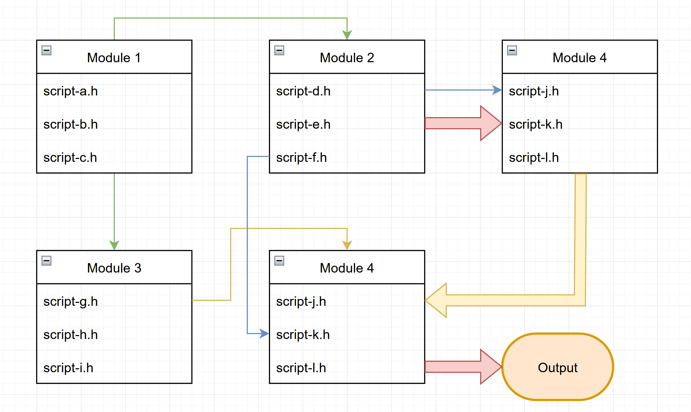

# 1. Project Overview

This project is a simplified version of the Pikachu Matching Game, runs on *amd64/x86_64 Linux Bash Terminal* and *x32/x64 Windows Terminal*. All of the source codes are contributed by Luu Nam Dat (Student ID 22127062) and Nguyen Huynh Hai Dang (Student ID 22127052). All of the source codes are integrated and maintained in the codebase by Luu Nam Dat. Any referenced code is cited in the beginning of its corresponding file, and is cited in section x.x.x.

The gameplay demonstration of this project can be found on youtube [here](https://www.youtube.com).

# 2. Project Hierarchy

## 2.1. Diagram explanation

The hierarchy of this project is visualized via a diagram in section *2.2*. The diagram divides the source code into modules, each module has its relations to other modules indicated by arrows. A sample diagram is shown in *figure 1*.

In *figure 1*, arrows that are connected to the bottom or the top of a box (like green and yellow arrows) indicates the relation of any item to a **module**. While arrows that are connected to the side of a box (like blue or yellow arrows) indicates the relation of any item to a **script**.

Additionally, a thin arrow from *A* to *B* shows that *A* exports parameters and methods (functions) to *B*. On the other hand, a thick arrow from *C* to *D* shows that *C* exports data to *D*.
