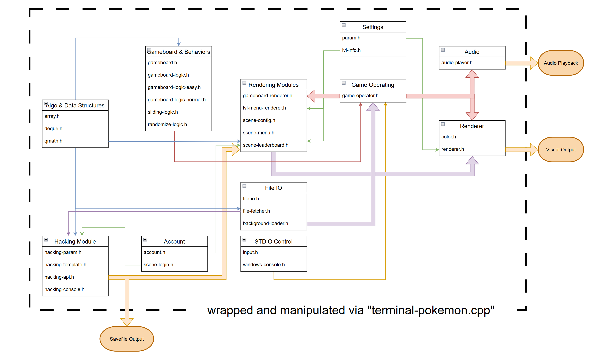
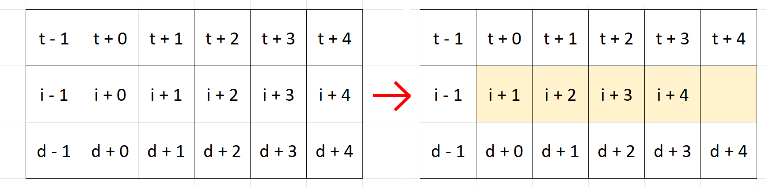
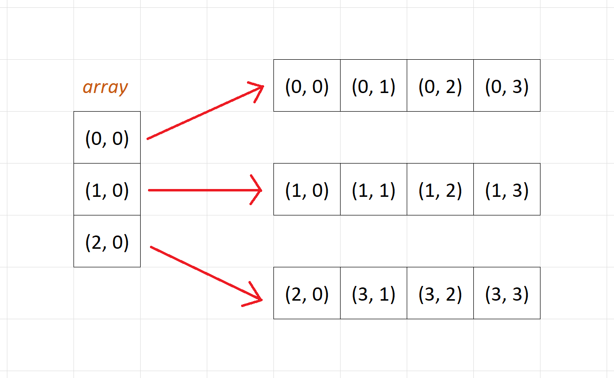

# Chapter 1. Project Overview

This project is a simplified version of the Pikachu Matching Game, runs on *amd64/x86_64 Linux Bash Terminal* and *x32/x64 Windows Terminal*. All of the source codes are contributed by Luu Nam Dat (Student ID 22127062) and Nguyen Huynh Hai Dang (Student ID 22127052). All of the source codes are integrated and maintained in the codebase by Luu Nam Dat. Any referenced code is cited in the beginning of its corresponding file, and is cited in **Chapter 5 - References**.

The gameplay demonstration of this project can be found on youtube [here](https://www.youtube.com).

\pagebreak

# Chapter 2. Project Completion

The following table shows which of the required features are implemented and where they are. How they are implemented is later explained in **Chapter 6 - Implementation**.

| Feature                   | Completed | Implemented in               | Documented in |
| ------------------------- | --------- | ---------------------------- | ------------- |
| Game Starting             | Yes       | src/terminal-pokemon.cpp     | 6.9           |
| Matching I                | Yes       | src/gameboard-logic-*.h      | 6.4.4         |
| Matching L                | Yes       | src/gameboard-logic-*.h      | 6.4.4         |
| Matching U                | Yes       | src/gameboard-logic-*.h      | 6.4.4         |
| Matching Z                | Yes       | src/gameboard-logic-*.h      | 6.4.4         |
| Game Finish Verification  | Yes       | src/gameboard-logic-*.h      | 6.4.4         |
| Color Effect              | Yes       | src/color.h                  | 6.8           |
| Visual Effect             | Yes       | Rendering Modules            | 6.9           |
| Sound Effect              | Yes       | src/audio-player.h           | 6.6           |
| Background                | Yes       | src/gameboard-renderer.h     | 6.9.5         |
| Leaderboard               | Yes       | src/scene-leaderboard.h      | 6.9.4         |
| Move Suggestion           | Yes       | src/gameboard-logic-*.h      | 6.4.4         |
| Stage Difficulty Increase | Yes       | src/sliding-logic.h          | 6.4.4         |
| Save file Hacking         | Yes       | Hacking Module               | 6.12          |
| Board definition          | Yes       | src/gameboard.h              | 6.4.1         |
| 2d-Linkedlist Board       | Yes       | sub/gameboard.h              | 6.5           |
| Account definition        | Yes       | src/account.h                | 6.11          |
| Binary save file          | Yes       | src/hacking-api.h            | 6.12          |

: List of completed programming and technical requirements

Asides from **Source code aesthetics, Source code comments, Game performance,** and **Game aesthetics**—whose completion can not be marked as "Yes" or "No"—all other programming and technical requirements are all met.

Next, a table is provided to show which of the documentation requirements are done:

| Requirement                    | Completed | Documented in |
| ------------------------------ | --------- | ------------- |
| Members info                   | Yes       |               |
| Game Tutorial                  | Yes       |               |
| Project hierarchy explanation  | Yes       | Chapter 3     |
| Program executing instruction  | Yes       | Chapter 4     |
| Pointer/Linkedlist Comparision | Yes       | 6.5.5         |
| References                     | Yes       | Chapter 5     |
| Demonstration Video            | Yes       | [youtube](https://www.youtube.com) |
| English                        | Yes       |               |
| Latex                          | Yes       |               |

: List of completed documentation requirements

Additionally, this project is also delivered with extra features, which are:

+---------------------------------------------------------------+------------------------------+-----------------------+
| Feature                                                       | Implemented in               | Documented in         |
+===============================================================+==============================+=======================+
| Free Match Mode: A new difficulty level,\                     | src/gameboard-logic-easy.h   | 6.4.3                 |
| where the player can match tiles in any pattern\              |                              |                       |
| and not just in `I L U Z` shapes                              |                              |                       |
+---------------------------------------------------------------+------------------------------+-----------------------+
|                                                               |                              |                       |
+---------------------------------------------------------------+------------------------------+-----------------------+
| Randomizer Mode: A new difficulty level,\                     | src/randomize-logic.h        | 6.4.5                 |
| where tiles sometimes move themselves towards\                |                              |                       |
| arbitrary directions                                          |                              |                       |
+---------------------------------------------------------------+------------------------------+-----------------------+
|                                                               |                              |                       |
+---------------------------------------------------------------+------------------------------+-----------------------+
| Background Customization: Allows the user\                    | src/background-loader.h      | 6.3                   |
| to add/edit/remove background images                          |                              |                       |
+---------------------------------------------------------------+------------------------------+-----------------------+

: List of extra features

\pagebreak

# Chapter 3. Project Hierarchy

## 3.1. Diagram explanation

The hierarchy of this project is visualized via a diagram in section *3.2*. The diagram divides the source code into modules, each module has its relations to other modules indicated by arrows. A sample diagram is shown in the figure below:


In the figure, arrows that are connected to the bottom or the top of a box (like green and yellow arrows) indicates the relation of any item to a **module**. While arrows that are connected to the side of a box (like blue or yellow arrows) indicates the relation of any item to a **script**.

Additionally, a thin arrow from *A* to *B* shows that *A* exports parameters and methods (functions) to *B*. On the other hand, a thick arrow from *C* to *D* shows that *C* exports data to *D*.

\pagebreak

## 3.2. Project Hierarchy



This project consists of 55 source code scripts; 31 of them are ".h" files and 24 others, ".cpp" files. Each of them serves a specific role and is grouped into a module. This section briefly explains the usage of each module, then the detailed implementation shall be addressed in **Chapter 6 - Implementation**.

### 3.2.1. Algorithms & Data Structures

This module provides 2 simple data structures that are used thorough the project: Array and Deque; and a simple sorting algorithm used for ranking players: Bubble Sort.

### 3.2.2. STDIO Control

Offers functions to detect and extract keypresses. On Windows, this module provides additional controls to the terminal so as to optimize the poor performance of Windows' console.

### 3.2.3. File IO

Contains functions to list files in any directory (folder) and load some files into game objects.

### 3.2.4. Gameboard & Behaviors

Defines the gameboard structure & its operating logics. Matching rules, tiles sliding rules, and extra rules are defined here.

This module only implements the gameboard as a 2 dimensional array. In order to satisfy the additional requirement, a small game which implements the gameboard as a 2 dimensional linked list has also been developed and included in this project under directory `"sub/"`.

### 3.2.5. Audio

Emits sounds in fixed frequencies and durations.

### 3.2.6. Settings

Determines console resolution, quantity of difficulty levels and stages, as well as other constant values.

### 3.2.7. Renderer

This module provides a grid for other modules to draw on, and then it prints that grid onto the console.

Also supports printing with background color and foreground color.

### 3.2.8. Rendering Modules

Delivers functions to draw some data into the Renderer's grid. Such data are the gameboard, the leaderboard, the title menu, the level selector, etc...

### 3.2.9. Game Operating Module

Operates the game. This module wraps the gameboard, the input control, the renderer, and the audio player altogether to make the game playable.

### 3.2.10. Account

Account object definition & logging in interface.

### 3.2.11. Hacking Module

The module to fulfill the "savefile hacking" requirement.

\pagebreak

# Chapter 4. Dependencies

On Linux, this project has no dependencies other than the C++ standard library. On Windows, this project additionally requires the Windows API header file `"windows.h"`, which should already be available after MinGW installation.

All used libraries are:

- `cstdint` *(access to uint8_t, uint16_t,...)*
- `cstdio`
- `cstdlib` *(access to system)*
- `cstring`
- `ctime`
- `fstream`
- `iostream` *(to take advantage of the fact that iostream is not synced with stdio)*
- `random`
- `string`

Exclusive libraries for Linux:

- `filesystem` *(to list files in a directory)*
- `chrono` and `thread` *(to make a sleep function)*
- `termios.h`, `sys/ioctl.h`, `sys/select.h` *(to detect user keypress)*

Exclusive libraries for Windows:

- `conio.h` *(to detect user keypress)*
- `dirent.h` *(to list files in a directory)*
- `windows.h`

This project was built successfully on the following compilers:

- g++ (GCC) 12.2.1 20230201
- g++ (Debian 10.2.1-6) 10.2.1 20210110
- g++ (MinGW.org GCC-6.3.0-1) 6.3.0

The build scripts for this project are also provided. To build the game, execute `build.sh` on Linux or `build.bat` on Windows. To build the sub-version of the game which implemented the gameboard as a 2 dimensional linked list, execute `build-linkedlist-game.sh` on Linux or `build-linkedlist-game.bat` on Windows.

The executable files after build would be:

| Operating System | Main Game | Substitute game    |
| ---------------- | --------- | ------------------ |
| Linux            | o.exe     | linkedlist.exe     |
| Windows          | o-win.exe | linkedlist-win.exe |

: List of Executable files

\pagebreak

# Chapter 5. References

Before going to the detailed implementation, all references are firstly cited, as well as why they are necessary to this project is also addressed.

Beyond this chapter, all line of codes belongs to Luu Nam Dat and Nguyen Huynh Hai Dang.

```


```

| Source                                                                                                                                                                       | Application                                                          |
| -----------------------------------------------------------------------------------------------------------------------------------------------------------------------      | -------------------------------------------------------------------- |
| "Bash - adding color" http://www.andrewnoske.com/wiki/Bash_-_adding_color                                                                                                    | Add colored text to the console output                               |
| |
| Morgan McGuire "\_kbhit() for Linux" <br> https://www.flipcode.com/archives/ <br> \_kbhit\_for\_Linux.shtml                                                                  | Detect user keypress on POSIX operating systems                      |
| |
| "How can I get the list of files in a directory using C or C++" <br> https://stackoverflow.com/questions/612097/how-can-i-get-the-list-of-files-in-a-directory-using-c-or-c  | List files in a directory on different operating systems             |

: Code References

```


```

| Source                                                                                                                | Application                                                          |
| --------------------------------------------------------------------------------------------------------------------- | -------------------------------------------------------------------- |
| "Standard C++ Library reference" <br> https://cplusplus.com/reference/                                                | Documentation of the C++ standard library                            |
| |
| "Windows API Reference" <br> https://learn.microsoft.com/en-us/previous-versions//aa383749(v=vs.85)                   | Documentation of the `<windows.h>` header file                       |
| |
| neilharan "OpenAFIS - A high performance C++ fingerprint matching library" <br> https://github.com/neilharan/openafis | This repository's source code organization is applied in our project |

: Documents

\pagebreak

# Chapter 6. Implementation

This chapter explains how each module was implemented and what algorithms and techniques were used in the process. 

## 6.1. Algorithms & Data Structures

This module consists of 3 header files: "qmath.h", "deque.h", and "array.h"

"qmath.h" *(abbreviation of "quick math")* is designed to provide handy mathematic functions and simple algorithms such as a sorting algorithm. Currently, it only has a simple Bubble Sort function, but that alone is already enough for this project.

"deque.h" implements a double-ended queue via a linked list. It is a data structure that can dynamically be expanded or contracted on both ends (either front or back) in $O(1)$. It is possible to access/add/modify/remove arbitrary elements in this data structure as well, and "deque.h" also provides all necessary methods to do that. But these methods are never used in this project since accessing an arbitrary element in a linked list has $O(N)$ time complexity, where $N$ is the number of elements in the list.

"array.h" provides a wrapper for C++ dynamic array. In C++, creating an dynamic array via a pointer (for example: `type* arr = new type[length]`) can be quite inconvenient. The created object does not keep track of its length on its own, and it needs to be deallocated manually via a `delete` keyword. Using built-in structures like `std::vector` and `std::array` are encouraged thereof; but to reduce the project's dependency, "array.h" is introduced to replicate the usage of `std::array`.

While "qmath.h" is only used in the leaderboard feature, "deque.h" and "array.h" are robust containers which are used thorough the project as a substitute for static array, pointer array, `std::array`, `std::vector`, `std::queue` and many more built-in containers.

## 6.2. STDIO Control

This module consists of 2 header files: "input.h" and "windows-console.h"

"input.h" is simple. It offers a function to wait for the user's keypress then return which key is pressed. Works on Windows, UNIX-like and POSIX operating systems.

"windows-console.h" provides exclusive functions for Windows so as to optimize the poor performance of the Windows' Terminal. It allows a program to re-render arbitrary cell on the console, which reserves computing resources from being wasted into re-rendering cells that have not been update after a frame. "windows-console.h" is possible thanks to the Windows' API header file `<windows.h>`

Regarding of how poor the Windows' Terminal performs without "windows-console.h", a small benchmark is proposed in order to measure the fps (frames per second) of this game with "windows-console.h" removed. The game has the resolution of $120\times40$ (measured in characters). The benchmark runs on only one computer with a *11th Gen Intel i5-11320H (8) @ 3.187GHz CPU*, but on different operating systems and terminal emulators. The result is shown in the table below:

| Platform                                            | FPS   |
| --------------------------------------------------- | ----- |
| Native Arch Linux x86_64 (Kernel: 6.1.11-arch1-1)   | 144.7 |
| Debian GNU/Linux 11 (bullseye) on Windows 10 x86_64 | 91.4  |
| Alacritty terminal emulator on Windows 10           | 91.2  |
| Windows 10 Terminal (cmd.exe/powershell.exe)        | 0.3   |

: Performance Benchmark on various platforms

## 6.3. File IO

This module consists of 3 header files: "file-fetcher.h", "file-io.h", and "background-loader.h". It provides all necessary tools for the game (excluding the hacking module) to read or write any file in the file system. 

"file-fetcher.h" offers a function to list all files in a directory. This help the program to recognize multiple save files, multiple background image files,... with ease.

"file-io.h" reads a pre-designed gameboard binary file and then feeds it to the program. A gameboard object is built upon this.

"background-loader.h" reads a background image text file and then represents it as a 2 dimensional array, which is fed to "gameboard-renderer.h" (documented in *6.9.5*). By using "file-fetcher.h", it can detect and load any image under directory `bgr/`. Therefore, the player can add/edit/remove any image in `bgr/` as they want. If there are multiple images provided, "background-loader.h" will randomly choose one of them.

## 6.4. Gameboard & Behaviors

The Gameboard & Behaviors Module consists of 6 header files: "gameboard.h", "gameboard-logic.h", "gameboard-logic-easy.h", "gameboard-logic-normal.h", "sliding-logic.h", and "randomize-logic.h". This is the most complicated module in the project as it covers a lot of contents:

- 5 standard features: I/L/U/Z Matching and Game finish verification
- An advanced feature: Move suggestion
- An extra advance feature: Stage difficulty increase
- 2 extra features: Free Match Mode and Randomizer Mode (as mentioned in **Chapter 3 - Features**)
- A vital component which gives data to generate visual effects.
- Complete a technical requirement: Gameboard definition

By explaining the usage and the implementation of each script in this module, this section shall then clarify how each of those features were accomplished.

\pagebreak

### 6.4.1. About "gameboard.h"

It is a technical requirement to declare a gameboard structure using both a 2 dimensional array and a 2 dimensional linked list. This project offers 2 seperated games, where the main game (under directory `src/`) implements the game board via array and the substitute game (under directory `sub/`) doing so via a linked list. This section covers the array version of the gameboard, while the other version is covered in section *6.5*.

The array version of the gameboard is straight-forward. The structure implemented in `src/gameboard.h` consists of these properties to simulate the geometric attributes of the board:

```C++
uint8_t h, w;   // the height and width of the board, measured in cells
uint8_t** map;  // map[i][j] stores the id of the cell at row `i` column `j`
```

The `gameboard.h` structure also comes with extra properties and methods to calculate the current score of the player, and to keep track of number of helps used. A constructor and a deconstructor are also writen for convenient development reasons.

### 6.4.2. About "gameboard-logic.h"

Contains a class `GameboardLogic` which acts as a interface, offering functions to check the legitimacy of a match, to trace the path between 2 cells, and to suggest a move.

```C++
class GameboardLogic {
    // check if cell (y0, x0) can be matched with cell (y1, x1)
    virtual bool validate(uint8_t y0, uint8_t x0, uint8_t y1, uint8_t x1);

    // suggest a move
    // return format: (y1<<24) | (x1<<16) | (y0<<8) | x0
    virtual uint32_t suggest();

    // get the path from (y0, x0) to (y1, x1)
    // the i-th element in the deque is the coordinate of the i-th cell in the path
    // encoded in format: (y<<8)|x
    virtual Deque<uint16_t> get_path(uint8_t y0, uint8_t x0, uint8_t y1, uint8_t x1);
};
```

Such interface exists to allow derivation. The game which this project delivers has multiple difficulty levels, some of which have different matching rules than others. Thereof, multiple logic classes are written so as to operate the game in different game modes. While having distinctive behaviors, all of these classes inherit the `GameboardLogic` interface, and they all can be treated as `GameboardLogic` objects by the program. This fact greatly reduces the complexity of the source code.

\pagebreak

### 6.4.3. About "gameboard-logic-easy.h"

Contains a class `GameboardLogicEasy` which derives from the `GameboardLogic` interface. The `validate` method of this class checks whether two cells can be matched in any pattern (not just in patterns I/L/U/Z).

The `validate` method is implemented via **BFS** (breath-first search). In summary, **BFS** is a simple and fundamental algorithm that access all nodes in a graph (in this case: All cells in matrix). The procedure of the algorithm is described as follow:

Step 1 - Initialization:

- All nodes are marked as *"unvisited"* except the starting node.

- Prepare a queue $Q$ that only has the starting node as its only element.

Step 2 - Repeat until $Q$ is empty:

- Pop node $u$—the first element in $Q$—out of $Q$

- For every *unvisited* node $v$ that is adjacent to $u$:

    - mark $v$ as $visited$

    - insert $v$ to the back of $Q$

    - Let $P_{v} \leftarrow u$, where $P_{y} = x$ means node $y$ was visited from $x$

By using **BFS** to check whether a cell can be accessed from another cell in the matrix, matching validation, game finish verification, and move suggestion can be done at ease. The next task is to retrieve the path between these two cell in order to generate the matching visual effect. This project performs the task via a simple **DFS** (depth-first search) function, whose procedure is described as follow:

Step 1 - Initialization:

- Take two parameters: $s$ and $e$. Where $s$ is the node from which the previous $BFS$ started, and $e$ is a node that can be accessed from $s$.

- Prepare a queue $Q$

- Let $u \leftarrow e$

Step 2 - Repeat until $u$ equals $s$:

- Add $u$ to the front of $Q$

- $u \leftarrow P_{u}$

Once the procedure is done, the $i$-th element in $Q$ is the $i$-th cell in the path from $s$ to $e$.

\pagebreak

### 6.4.4. About "gameboard-logic-normal.h"

Contains a class `GameboardLogicNormal` which derives from the `GameboardLogic` interface. The `validate` method of this class checks whether two cells can be matched in patterns I/L/U/Z.

`GameboardLogicNormal` is implemented with the same algorithms as `GameboardLogicEasy`. Nevertheless, since there are only a limited number of patterns allowed, a simple dynamic programming technique is integrated in order to prevent undesired patterns. The **BFS** procedure is re-written as follow:

Step 1 - Initialization:

- Let $T_{id}$ be the minumum number of turns taken in order to reach node $i$ from direction $d$. In this game, there are 4 directions (top/left/down/right) and 2 turns in maximum (shape I has 0 turn, shape L has 1 turn, shapes U and Z has 2 turns).

- Prepare a queue $Q$ with only one element $q_{1} = \{u_{1}, t_{1}, d_{1}\}$, where $u_{1}$ is the starting node, $t_{1} = 0$ is the numbers of turns taken, $d_{1} = NULL$ is the direction which this node was traveled from (here $d_{1}$ is set to $NULL$ because $u_{1}$ is the first node)

Step 2 - Repeat until $Q$ is empty:

- Pop $q=\{u, t, d\}$—the first element in $Q$—out of $Q$

- For every node $v$ that is adjacent to $u$:

    - Let $d'$ be the direction from $u$ to $v$. 

    - If $d' \neq d$ then $t' \leftarrow t+1$, else if $d' = d$ then $t' \leftarrow t$

    - If $t' > 2$ then break and go to the next iteration.

    - Otherwise, if $t' < T_{vd'}$ or $v$ has not been visited via direction $d'$, then insert $q' = \{ v, t', d' \}$ to the back of $Q$

    - If $q'$ is inserted to $Q$, $P_{vd'} \leftarrow \{ u, d \}$

With this small improvement, a `GameboardLogicNormal` object can check whether it is possible to match a pair of cells via a I/L/U/Z shaped path. If the **BFS** starts from cell $(y_{1}, x_{1})$ and it meets $(y_{2}, x_{2})$ while **BFS** is running, it implies that these two cells can be matched together. The algorithm can also suggest moves and verify game state by pointing out a matchable pair.

To retrieve the path from $s$ to $e$ where $e$ is accessible from $s$, another **DFS** algorithm is implemented. This is just as simple as the previous one, and it has virtually no improvement:

Step 1 - Initialization:

- Prepare a queue $Q$

- Choose $d$ such that $P_{ed}$ exists. Let $u \leftarrow e$.

Step 2 - Repeat until $u$ equals $s$:

- Add $u$ to the front of $Q$

- Let $p \leftarrow P_{ud} = \{ p_{u}, p_{d} \}$. $u \leftarrow p_{u}$, $d \leftarrow p_{d}$

Once the **DFS** function finishes, the $i$-th element in $Q$ is the $i$-th cell in the path from $s$ to $e$.

### 6.4.5. About "randomize-logic.h"

Simply moves cells in the gameboard towards random directions. This act grants the game an extra feature "Randomizer Mode".

The moving cells also generate visual effects to show the path they have taken.

### 6.4.6. About "sliding-logic.h"

Offers a function to removes the gaps between cells along a direction. This simulates tiles sliding, and thus this partially accomplishes the "Stage Difficulty Increase" extra-advanced feature.

However, in "Stage Difficulty Increase" feature description, there is a requirement to implement the gameboard as both a 2 dimensional array and a 2 dimensional linked list. This module's `Gameboard` structure uses an array. And to fully complete the extra-advanced feature, a substitute game (under directory `sub/`) which implements the gameboard via linked list was developed.

## 6.5. Linked List Gameboard & Behaviors

As mentioned in section *6.4.6.*, this project contains a substitute game which implements the gameboard via a 2 dimensional linked list. This section explains how the `Gameboard` structure was defined in that game.

The linked list in the `Gameboard` structure is a chain consists of `Nodes`. Each `Node` has two properties:

```C++
struct Node {
    Node* adj[4]; // adj[ T/L/D/R ] = pointer to top/left/down/right adjacent node
    char val;     // the value which this node holds
}
```

We then propose various procedures to make this linked list functional.

### 6.5.1. Build the linked list

Assume the level data is first read from a file and is represented via a 2 dimensional array $M$, where $M_{yx}$ is the id of the cell at row $y$ column $x$. Then, $N_{xy}$ is a node that has its properties as follow: 

```C++
    //         top node    left node   down node   right node
    adj[4] = { &N[y-1][x], &N[y][x-1], &N[y+1][x], &N[y][x+1] };
    val = M[y][x];
```

### 6.5.2. Access and Remove an arbitrary node

Without the sliding cells rule, accessing and removing any node is easy. When the player makes a successful match between two cells $(y_{1}, x_{1})$ and $(y_{2}, x_{2})$, simply travel to these two cells in the linked list and mark their values as *"Empty"*.

Let $I$ be the top-left node of the linked list. The function to access cell $(y, x)$ is:

```C++
    Node* get_node(unsigned int y, unsigned int x) {
        Node* ans = I;
        while (y--) ans = ans->adj[DOWN];   // go down `y` times
        while (x--) ans = ans->adj[RIGHT];  // go right `x` times
        return ans; // `ans` is now cell (y, x)
    }
```

### 6.5.3. Access and Remove an arbitrary node in sliding game

Assume erasing a node $i$ and then slide neibouring nodes into the newly emptied space in direction from $p$ to $q$. When the sliding rule is applied, it is guaranteed to be no gap between cells along the slide direction, so there is no need to mark a node as *"Empty"* while erasing cells. Instead, modify the `adj` propery of $i$'s adjacent nodes:

```C++
    Node* node_at_p = i->adj[p];
    Node* node_at_q = i->adj[q];
    node_at_p->adj[q] = node_at_q;
    node_at_q->adj[p] = node_at_p;
    delete i;   // this node is no longer needed
```

{width=80%}

Let $r$ and $s$ be the directions that are orthogonal to $\vec{pq}$. As it can be observed in the figure above, cells that are affected by erasing node $i$ have their adjacent nodes to the $r$ and $s$ directions changed. These cells are updated in the program via an $O(N)$ time complexity function, where $N$ is the count of affected cells.

The `Gameboard` structure also has extra tools to control unexpected null pointers that appear when the cells are slided. It is guaranteed to be no segmentation fault while running the game.

### 6.5.4. An alternative linked list

Before going into the performance comparison between Linked List and Array, we propose an alternative approach to create a two dimensional linked list: Array of Linked Lists. In this approach, cell $(y, x)$ can be accessed in the $x$-th element of the $y$-th linked list in the array.

{width=80%}

An array of 1d linked lists is less complex than a 2d linked list, since every node in a 1d linked list only has two adjacent nodes at maximum. This fact makes the sliding function work in $O(1)$, because if node $i$ is deleted, we only need to update the `adj` property of the nodes to the $p$ and $q$ direction of $i$. Accessing and removing a node is also done more efficiently, because this structure can access any row in $O(1)$.

However, the `Gameboard` structure implemented in `sub/gameboard.h` is a 2d linked list. This choice was made in order to clearly portray the discrepancy between linked lists and arrays.

### 6.5.5. Performance Comparision - Linked List and Array

Let $N$ and $M$ be the number of rows and columns in the gameboard. The following table shows the time complexity of different implementations of the gameboard.

|                         | 2D Array         | Array of 1D Linked List | 2D Linked List   |
| ----------------------- | :--------------: | :---------------------: | :--------------: |
| Access arbitrary cell   | $O(1)$           | $O(N)$ or $O(M)$        | $O(N+M)$         |
| Remove arbitrary cell   | $O(1)$           | $O(1)$                  | $O(1)$           |
| Slide cells             | $O(N)$ or $O(M)$ | $O(1)$                  | $O(N)$ or $O(M)$ |

: Time Complexity Comparison between 2D Array, Array of 1D Linked List, and 2D Linked List

Note that in order to remove a cell or slide some cells, which cell to be removed/to be slided to must first be specified. This requires a node access, whose complexity is $O(1)$ for 2D array, $O(N)$ or $O(M)$ for Array of 1D Linked List, and $O(N+M)$ for 2D Linked List. Consequently, every utility is done more efficent via a 2D Array than any Linked List implementation.

\pagebreak

## 6.6. Audio

This module consists of only one file: "audio-player.h", which uses the Windows API header `<windows.h>` to emit sounds in fixed frequencies and durations.

## 6.7. Settings

This module consists of 2 files: "param.h" and "lvl-info.h"

"param.h" defines the console resolution and might have been defined more constants if the project needed expansion.

"lvl-info.h" defines constants that declare available difficulty levels and game stages.

## 6.8. Renderer

This module consists of 2 header files: "color.h" and "renderer.h"

"color.h" defines available colors and functions to control the foreground/background color of the program's output. These functions achieve this by printing specific formatting commands to the console. The source for the formatting commands is cited at **Chapter 5 - References**.

"renderer.h" provides a grid called a **"map"** for other modules to draw on, and then it prints **the map** onto the console. This header file also provides other grids, where each cell of these grids defines an attribute of its corresponding cell in **the map**. Such attributes are foreground color, background color, and font thickness.

By design, while the game is running, only the *Renderer Module* and the *STDIO Control Module* have the privilege to print characters on the console. For a console game that use no game development library, this design makes the project fundamentally easy to be controlled as it clearly seperates the frontend from the backend.

## 6.9. Rendering Modules

This module consists of 5 header files: "gameboard-renderer.h", "lvl-menu-renderer.h", "scene-config.h", "scene-menu.h", and "scene-leaderboard.h". These files take backend data, then they write it onto the Renderer's grid, which is then printed onto the console.

### 6.9.1. About "scene-config.h"

Different Windows versions use different terminal emulators. The early versions of Windows 10 use "cmd.exe", while the default of Windows 11 is "Windows Terminal". This "Windows Terminal", however, does not support many functions in the Windows API header file. And some of those functions are the ones that allow the program to control the console's layout, buffer size, etc...

This leads to the lack of automatic screen size configuration of the game. And thus, "scene-config.h" is written in order to help the player configure their console manually. It repeatedly prints out a grid that only forms into a shape once the console has reasonable size, then the player can turn this scene off and come back to playing the game.

### 6.9.2. About "scene-menu.h"

This is the title scene of the game, which consists of many buttons that lead to another scenes upon being pressed. It also offers an "exit" button.

### 6.9.3. About "lvl-menu-renderer.h"

Renders a stage selector using the Renderer Module, then tells the program which stage was selected by the user.

### 6.9.4. About "scene-leaderboard.h"

Loads the leaderboard of the selected stage. 

"scene-leaderboard.h" fetches all the save files of multiple players who have played the stage, stores their records' information into an array, sorts it, and finally, renders the score table using the Renderer Module.

### 6.9.5. About "gameboard-renderer.h"

Takes a gameboard, then fancily draws the gameboard onto the Renderer's grid. Each cell in a gameboard is drawn as a rectangular box in the grid, and empty spaces are replaced by their corresponding pixels in the selected background image.

## 6.10. Game Operating Module

This module consists of 1 header file: "game-operator.h"

"game-operator.h" wraps many modules together in order to make the game playable. It controls the sequence of events that happen when the game is being played, such as when to read the user's keypress, when to draw an animation onto the console, when to play sound, when to check whether the game has no more possible move, etc...

There is one script that functions similarly to the Game Operating Module - "terminal-pokemon.cpp". This script contains the `main` function and it wraps all module altogether to control the life cycle of the game, which starts when the user launches the ".exe" file, and ends when the user presses "exit". It can be said that while "game-operator.h" controls the flow of events in gameplay, "terminal-pokemon.cpp" controls the flow of the whole application.

## 6.11. Account

This module consists of 2 header files: "account.h" and "scene-logic.h"

"account.h" defines the `Account` structure. It also offers a function to register a new account, and a function to validate login credentials. Registered account information is stored under directory `sav/usrdata.bin`.

"scene-login.h" provides a simple command line interface for the user to log in, or to register a new account. It comes with a feature that hides user's input as they type their password.

## 6.12. Hacking Module

This module consists of 4 header files: "hacking-param.h", "hacking-template.h", "hacking-api.h", and "hacking-console.h"

This module exists to fulfill the "save file hacking" extra-advanced feature. It is designed to be able to read the `sample.bin` template save file, as well as to save data into binary files with the same structure as `sample.bin`.

Before going to the implementation, however, the flaws and errors of the `sample.bin` file is firstly addressed. An error is defined as something in `sample.bin` that does not match the project statement. And a flaw is defined as a mistake made by the statement giver which can result in save file corruption.

### 6.12.1. The Flaws of the Statement

By the design of the statement giver, all `char` type data is encoded by performing a $XOR$ operator with an arbitrary mask. However, the `sample.bin` file did not fully encoded all `char` type data in string fields (such as `username` and `password` fields), but only encoded them until the first character with value $0$ ($NULL$). Due to this flaw, all characters that have their value equals to the mask will become unrecoverable after encoding ($x \oplus x = 0$), as they are now being treated as $NULL$.

To handle the flaw, this project makes the mask **a constant** so that it can not encode common characters into $0$.

### 6.12.2. The Errors of the Materials

By the design of the statement giver, the first 101 bytes in the binary file would belong to the mask (1 byte), the username field (50 bytes), and the password field (50 bytes). The next 500 bytes should be $NULL$ bytes that act as a padding. However, starting from the 102-nd byte there continue to be data:

```
0000 0001 0000 0001 0000 00e7 0700 000a
```

The data above stores the references to the `record[5]` property and its first element, which suggests there is no padding at all.

To adjust to this error, this project skips this padding, and this only.

### 6.12.3. Implementation

"hacking-param.h" defines constants like username maximum length, password maximum length, etc... Using macros to define constants is considered bad practice in this project, so this kind of header files exists to wrap those constants instead.

"hacking-template.h" defines all hacking-related structures that are required in the statement. All of them have their name changed so as to fit in with the project. The changes can be referenced in the following table:

| Name in Statement      | Name in Implementation |
| ---------------------- | ---------------------- |
| State                  | HackingState           |
| Date                   | HackingDate            |
| Record                 | HackingRecord          |
| Savefile               | HackingSavefile        |

: The names of hacking-related structures in the Statement and in Implementation

Next, "hacking-api.h" provides tools to load a `HackingSavefile` object from binary file, as well as tools to write a `HackingSavefile` object into binary. This can easily be done by coordinating the fields in `HackingSavefile` accurately to their respective bytes in `sample.bin` template file.

Lastly, "hacking-console.h" offers an interface for the user to read or edit their save file. Some fields the players are allowed to edit are:

- The background URL of any stage they have played
- The final score of any of their records
- The complete date of any of their records
- The remaining cells of any of their records
