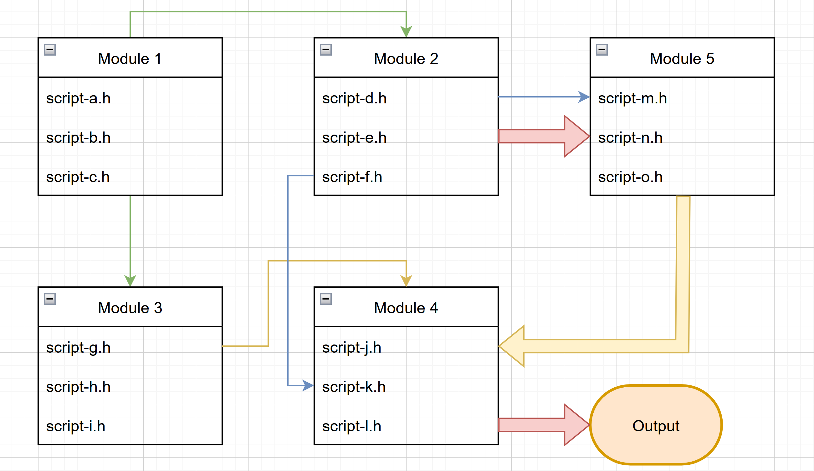
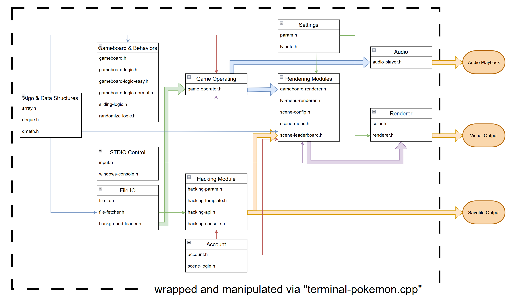

# 1. Project Overview

This project is a simplified version of the Pikachu Matching Game, runs on *amd64/x86_64 Linux Bash Terminal* and *x32/x64 Windows Terminal*. All of the source codes are contributed by Luu Nam Dat (Student ID 22127062) and Nguyen Huynh Hai Dang (Student ID 22127052). All of the source codes are integrated and maintained in the codebase by Luu Nam Dat. Any referenced code is cited in the beginning of its corresponding file, and is cited in section x.x.x.

The gameplay demonstration of this project can be found on youtube [here](https://www.youtube.com).

# 2. Project Hierarchy

## 2.1. Diagram explanation

The hierarchy of this project is visualized via a diagram in section *2.2*. The diagram divides the source code into modules, each module has its relations to other modules indicated by arrows. A sample diagram is shown in *figure 1*.

In *figure 1*, arrows that are connected to the bottom or the top of a box (like green and yellow arrows) indicates the relation of any item to a **module**. While arrows that are connected to the side of a box (like blue or yellow arrows) indicates the relation of any item to a **script**.

Additionally, a thin arrow from *A* to *B* shows that *A* exports parameters and methods (functions) to *B*. On the other hand, a thick arrow from *C* to *D* shows that *C* exports data to *D*.

## 2.2. Project Hierarchy

This project consists of 55 source code scripts; 31 of them are ".h" files and 24 others, ".cpp" files. Each of them serves a specific role, and scripts with similar roles are grouped into a module. This section briefly explains the usage of each module, then the detailed implementation shall be addressed in further sections.

### 2.2.1. Algorithms & Data Structures

This module provides 2 simple data structures that are used thorough the project: Array and Deque; and a simple sorting algorithm used for ranking players: Bubble Sort.

### 2.2.2. STDIO Control

Offers functions to detect and extract keypresses. On Windows, this module provides additional controls to the terminal so as to optimize the poor performance of Windows' console.

### 2.2.3. File IO

Contains functions to list files in any directory (folder) and load some files into game objects.

### 2.2.4. Gameboard & Behaviors

Defines the gameboard structure & its operating logics. Matching rules, tiles sliding rules, and extra rules are defined here.

This module only implements the gameboard as a 2 dimensional array. In order to satisfy the additional requirement, a small game which implements the gameboard as a 2 dimensional linked list has also been developed and included in this project under directory `"sub/"`.

### 2.2.5. Audio

Emits sounds in fixed frequencies and durations.

### 2.2.6. Settings

Determines console resolution, quantity of difficulty levels and stages, as well as other constant values.

### 2.2.7. Renderer

This module provides a grid for other modules to draw on, and then it prints that grid onto the console.

Also supports printing with background color and foreground color.

### 2.2.8. Rendering Modules

Delivers functions to draw some data into the Renderer's grid. Such data are the gameboard, the leaderboard, the menu, the level selector, etc...

### 2.2.9. Game Operating Module

Operates the game. This module wraps the gameboard, the input control, the renderer, and the audio player altogether to make the game playable.

### 2.2.10. Account

Account object definition & logging in interface.

### 2.2.11. Hacking Module

The module to fulfill the "savefile hacking" requirement.
